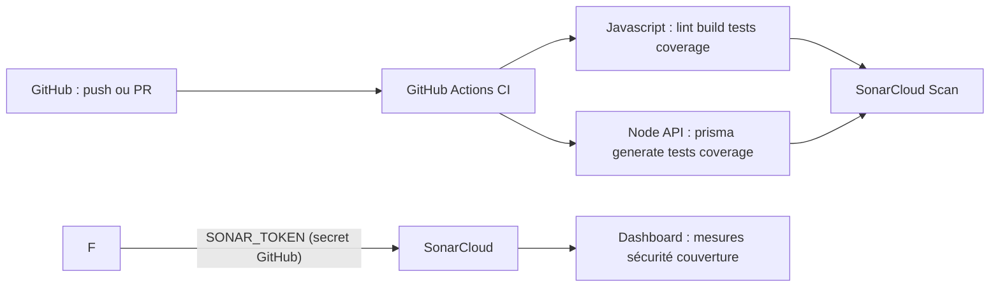

# Présentation — SonarCloud & GitHub Actions (projet NAFISSA)

Ce document s’adresse aux personnes qui découvrent **l’analyse automatique de qualité et de sécurité** du code. Objectif : comprendre **le rôle de chaque outil**, **pourquoi nous l’utilisons**, et **où regarder les résultats**.

---

## En une phrase

À chaque mise à jour du code sur GitHub, nos **pipelines automatiques** lancent les **tests**, génèrent la **couverture**, puis envoient le tout à **SonarCloud**. SonarCloud produit un **tableau de bord** : bugs, failles potentielles, dette technique, duplication, couverture de tests — **pour le frontend et le backend dans un seul projet d’analyse**.

---

## Chaîne vue par l’équipe

Traduction littérale du flux :

| Étape | Que se passe-t-il ? |
|-------|---------------------|
| **1. Push / PR** | Un développeur envoie du code sur `main`, `master` ou ouvre une *pull request*. |
| **2. GitHub Actions** | Les jobs définis dans `.github/workflows/ci.yml` démarrent sur des machines Linux gérées par GitHub. |
| **3. Tests & couverture** | Frontend et backend exécutent les tests Vitest ; des fichiers `lcov.info` sont produits puis sauvegardés comme *artifacts*. |
| **4. Scan SonarCloud** | Le workflow télécharge ces rapports à la même arborescence qu’en local puis lance l’action officielle **SonarScanner** (`SonarSource/sonarqube-scan-action@v6`). |
| **5. SONAR_TOKEN** | Un **secret** GitHub (jamais dans le code) identifie l’analyse auprès de SonarCloud. Sans ce secret, l’étape SonarCloud échoue. |
| **6. Dashboard** | Sur [sonarcloud.io](https://sonarcloud.io), le projet montre bugs, vulnérabilités, *code smells*, note de sécurité, nouveaux problèmes sur les PR si vous activez les *quality gates*. |

---

## Pourquoi SonarCloud (et pas seulement ESLint ou les tests unitaires)

| Besoin métier | Ce que nous avons déjà | Ce qu’ajoute SonarCloud |
|---------------|-------------------------|-------------------------|
| « Le build casse » | Tests CI, `eslint`, build Vite | Analyse plus large du code livré |
| « Y a-t-il une faille évidente ? » | Révision humaine | Règles de sécurité statiques orientées CWE / OWASP (selon offre et langage) |
| « Notre dette monte où ? » | Discussions | Métrique de fiabilité, maintenabilité, duplications dans le temps |
| « Qui a introduit cette régression de qualité ? » | Diff Git | Liaison fichier / ligne / nouvelle introduction sur les analyses successives |

ESLint vérifie des **conventions**. Les tests vérifient le **comportement attendu**. Sonar analyse le **flux et la surface du code** pour repérer des risques et des odeurs — **en complément**, pas en remplacement.

---

## Fichiers importants (pour ne pas se perdre)

| Fichier | Rôle |
|---------|------|
| `.github/workflows/ci.yml` | Enchaîne *frontend*, *backend-node*, puis *SonarCloud*. |
| `sonar-project.properties` (**à la racine**) | Définit projet, organisation SonarCloud, sources `backend-node/src` + `frontend/src`, chemins LCov pour la couverture. |
| Secret GitHub `SONAR_TOKEN` | Jeton d’analyse créé dans SonarCloud (*My Account* → Security → or project token). |

> **Une seule config Sonar au dépôt** : évite de lancer deux analyses différentes (ex. ancien fichier dans `frontend/` avec une autre `sonar.projectKey`). L’analyse monorepo se fait depuis la **racine** avec ce fichier principal.

---

## Ce que doit faire chaque développeur au quotidien

1. **Pousser une branche** ou ouvrir une PR comme d’habitude.  
2. Dans l’onglet **Actions** du dépôt, vérifier que les jobs verts passent (*Frontend*, *Backend Node*, **SonarCloud Scan**).  
3. Dans SonarCloud, consulter **Issues** ou **Pull Requests** (si intégration activée).  
4. Corriger en priorité : **blocking / high** sur sécurité, puis bugs, puis *smells* gênants pour la lisibilité.

---

## Glossaire ultra-court

- **Quality Gate** : seuil défini dans SonarCloud (ex. pas de nouvelles vulnérabilités bloquantes) ; peut faire échouer visuellement une livraison si non respecté.  
- **LCov** : format de rapport de couverture de tests consommé par Sonar avec `sonar.javascript.lcov.reportPaths`.  
- **Secret GitHub** : valeur chiffrée visible uniquement aux workflows ; **`SONAR_TOKEN` ne doit jamais être commité.**

---

## Dépannage express (équipe)

| Symptôme | Piste |
|----------|-------|
| Job **SonarCloud** rouge alors que tout le reste est vert | Mauvais **`sonar.organization`** ou **`sonar.projectKey`** par rapport au projet créé sur SonarCloud ; ou **`SONAR_TOKEN`** expiré / révoqué ; ou fichier `lcov` absent après téléchargement des artifacts. |
| Avertissement « action v4 non supportée » | Corrigé en passant à **`SonarSource/sonarqube-scan-action@v6`** (voir workflow actuel). |
| Pas de couverture sur le dashboard | Vérifier que `frontend/coverage/lcov.info` et `backend-node/coverage/lcov.info` sont bien présents après les jobs de tests et que les chemins dans `sonar-project.properties` correspondent. |

Pour le détail opérationnel (création de projet, jeton SonarCloud, analyse locale avec `sonar-scanner`), voir aussi **`GUIDE_SONARQUBE.md`**.

---

*NAFISSA — présentation interne CI / Qualité — SonarCloud + GitHub Actions.*
